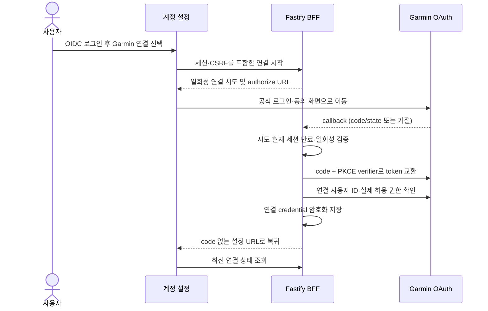

# Garmin 계정 연결 · 구현 결정

결정일: 2026-09-16. 사용자 결정: **기존 표준 OIDC 앱 로그인을 유지하고, 설정에 별도의 Garmin 연결 OAuth 흐름을 추가한다.**
상태: 설계·작업 분리 완료, **구현 진행 중**. 공식 앱 자격 증명과 실연동 검증은 미확인이다.
관련: FUT-04, V2-F25–F28/F30–F31, M1-06c, EXT-G, M1-06b.

## 앱 로그인과 데이터 연결

OIDC는 Workout Manager의 계정·세션을 식별한다. Garmin 연결은 이미 로그인한 앱 계정에 외부 데이터
접근 권한을 연결한다. Garmin 연결·실패·해제가 앱 로그인 공급자나 앱 계정 ID를 교체하지 않는다.
현재 계정 설정 진입점 `/account`에 독립적인 Garmin 연결 영역을 추가할 계획이다.

공식 [OAuth 2.0 PKCE 명세](https://developerportal.garmin.com/sites/default/files/OAuth2PKCE.pdf)는
Garmin Connect 로그인·공유 동의 후 authorization code를 앱으로 돌려주는 흐름을 설명한다.
사용자는 Garmin 화면에서 직접 로그인한다. 앱이 Garmin 비밀번호나 웹사이트 로그인 cookie를 수집하는
방식은 이 설계에 포함하지 않는다. 일반 Connect 웹사이트 로그인이 공식 API 이용 권한을 대신하지 않는다.

## 확인한 공급자 규격과 미확인 조건

2026-09-16 확인한 공개 OAuth 명세의 값이다. 개발 시 파트너 환경의 최신 명세와 다시 대조한다.

| 용도                  | 공개 명세                                                                     |
| --------------------- | ----------------------------------------------------------------------------- |
| Authorization         | `GET https://connect.garmin.com/oauth2Confirm`, code flow, PKCE S256          |
| Token / refresh       | `POST https://connectapi.garmin.com/di-oauth2-service/oauth/token`, form body |
| 연결 식별 / 허용 권한 | `GET https://apis.garmin.com/wellness-api/rest/user/id`, `/user/permissions`  |
| 연결 철회             | `DELETE https://apis.garmin.com/wellness-api/rest/user/registration`          |

공개 명세는 token 교환에 client ID·secret을 요구하고, API 범위는 앱 구성 및 사용자 동의에 따른다고
설명한다. 임의 scope로 접근 권한을 넓히지 않는다. 문서의 만료 설명과 응답 예시에 불일치가 있으므로
기간을 상수로 가정하지 않고 실제 검증된 응답의 만료 필드를 사용한다.

[공식 FAQ](https://developer.garmin.com/gc-developer-program/program-faq/)상 프로그램은 사업용이며
승인 뒤 개발자 portal을 제공한다. 프로젝트의 승인·client 발급·Activity/Health entitlement,
허용 callback 등록 조건·평가/production 환경은 아직 확인하지 않았다. 신청 가능 여부나 승인 일정을
확정하지 않는다. Webhook 인증·활동 payload·quota는 이 OAuth 명세로 추정하지 않는다.

## 구현 범위 · M1-06c

아래는 **앞으로 구현할 앱 설계**이며, 현재 사용 가능한 endpoint나 환경 설정을 뜻하지 않는다.

- 상태 조회, 연결 시작, callback, 연결 해제용 별도 `/bff/v1/integrations/garmin/*` 경로를 둔다.
  기존 `/bff/v1/auth/*` OIDC 경로와 세션 생성·회전 처리는 유지한다.
- 설정이 없으면 연결을 사용할 수 없는 이유를 표시하고 버튼을 비활성화한다. 미연결·연결 중·연결됨·
  재연결 필요·해제 처리 중·실패를 구분한다. OAuth 성공을 활동 자동 수집 성공으로 표시하지 않는다.
- 연결 시작·해제는 로그인, 현재 session ID, Origin·CSRF 검사를 거친다. callback은 외부 redirect라서
  custom header에 의존하지 않고, 서버에 보관한 짧은 수명의 일회성 state/PKCE 시도와 시작 계정·세션을
  현재 cookie 세션에 대조한다. 로그아웃·계정 전환·만료·중복 callback은 연결을 만들지 못한다.
- callback 입력은 엄격하게 검증하며 임의 return URL을 받지 않는다. 성공·거절·오류 모두 설정의 고정
  경로로 돌아가고 provider 오류 원문이나 code를 화면·로그에 남기지 않는다. 연결됨 표시는 최신 서버
  조회로 결정하며 query parameter만으로 성공 처리하지 않는다.
- client secret, PKCE verifier, access/refresh token은 서버 전용이다. 장기 credential은 인증된 암호화와
  키 버전을 사용해 저장하고 tenant를 분리한다. 브라우저 storage·Zustand·Query cache·export·로그에
  token을 넣지 않는다. 동시 refresh는 직렬화하고 회전된 refresh token을 원자적으로 교체한다.
- 외부 호출은 DB transaction 밖에서 제한된 timeout·응답 크기·origin으로 수행한다. 저장 직전에 계정
  삭제·세션 폐기·연결 revision을 다시 검사해 늦은 callback/refresh가 연결을 되살리지 못하게 한다.
- 연결 해제·계정 삭제는 진행 중인 연결 시도를 무효화하고 새 수집을 차단한다. 공급자 registration
  철회와 로컬 credential 정리를 처리하며, 공급자 실패 시 durable 재시도 상태를 남긴다. 철회에 필요한
  credential은 제한된 기간·접근 범위로만 보존하고 성공 또는 정해진 폐기 시점에 제거한다.
  이미 가져온 활동의 보존/삭제와 앱 계정 삭제는 구분해 표시한다.
- 연결 소유권 충돌과 재연결은 명시적으로 처리한다. OIDC 이메일과 Garmin 사용자 ID를 자동 병합하지
  않는다. 다른 앱 계정에 연결된 Garmin 계정을 조용히 이전하지 않는다.

Native 인증은 후속 native host에서 system browser/authentication session으로 연결한다.
이번 작업은 웹 설정 흐름이며 기존 privileged WebView에 외부 로그인 화면을 삽입하지 않는다.

## 검증과 완료 구분

M1-06c는 M1-01과 M1-06a를 선행 조건으로 하는 연결 기반 작업이다. 실제 Garmin 승인이 없어도
로컬 OAuth fixture로 구현·검증할 수 있다. 완료 조건은 다음과 같다.

- unit/API: PKCE·state, 거절·잘못된/만료 callback·재사용, 공급자 오류, 자격 증명 미설정, CSRF·세션 변경.
- 실DB: tenant 격리, 암호화 저장, 동시 refresh·해제·삭제 경쟁, rollback, export/log 비밀 제외,
  삭제 후 늦은 callback과 복구 후 credential 부활 방지.
- 실제 OIDC + 로컬 Garmin OAuth fixture + API/DB E2E: 연결·복귀·상태 조회·해제,
  앱 로그인 유지, 다른 탭의 계정 전환·오류 복구, 반응형·키보드 접근성.
- Aside 실 브라우저 확인, 독립 Herdr 리뷰, task별 커밋. 로컬 fixture 결과임을 검증 기록에 명시.

**EXT-G와 M1-06b는 별도로 유지한다.** 발급된 앱 자격 증명으로 공식 로그인·동의·실제 token·권한·철회를
확인하고, 공식 Activity/Health 수신부터 정본·화면까지 검증해야 실연동 완료다. 이 문서 추가나
M1-06c의 로컬 시험으로 해당 외부/출시 gate를 완료 처리하지 않는다.
