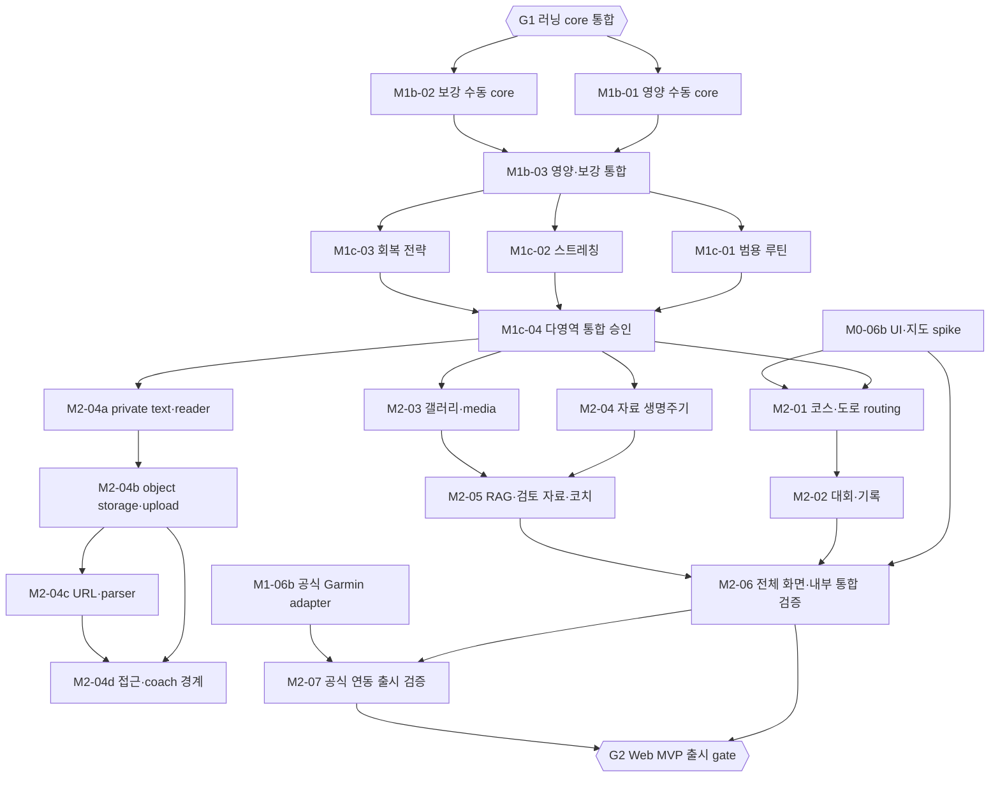
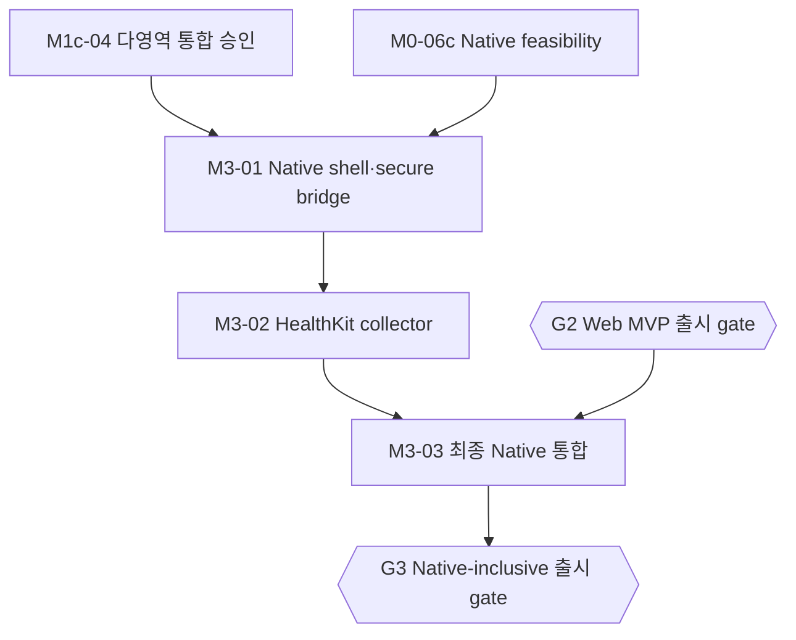

# 작업 의존성 및 병렬 진행

기준: [구현 계획](README.md). 초기 계획 이후 구현을 진행 중이다. 최신 상태와 검증 기록은 [task-graph.json](task-graph.json)의 status/evidence를 따른다.

러닝 core의 training-only 통합 수용 M1-05m과 내부 개발 gate G1은 완료했다.
[G1 기록](progress/G1.md)은 실제 OIDC·격리 DB 회귀를 대조하며, 공식 Garmin·실제 LLM·
지도·Native·출시 gate를 완료로 바꾸지 않는다.

M1c-01~03의 수동 core와 [제한된 운영 런타임 권한 코드](progress/M1c-runtime-grants.md),
[M1c-04 다영역 통합 승인](progress/M1c-04.md)은 완료했다. 훈련·영양·회복·루틴
일정의 schema v4 승인과 통합 Planner를 실DB 및 두 shell에서 검증했다.
[M2-04b 객체 저장·파일 upload](progress/M2-04b.md)는 완료했고 M2-04 전체는 진행 중이다.
URL/parser, 공유·coach 접근 경계는 M2-04c~d에 남는다. M2-03
갤러리·media도 ready 상태다. 지도 coverage·Native
실기기·공식 Garmin의 독립 gate는 유지한다.

M1-04는 [화면별 수용 대조](progress/M1-04.md)의 지도 독립 workbench 범위를 완료했다. S05 계획 종류는 운동·영양·회복·루틴
도메인 분류로 확정했고 운동 종목과 별도 필드로 유지한다. 지도·코치·제공자·Native 등 기존 후속
task의 미완료 범위는 별도로 유지한다.

M1-05b는 소유한 불변 계획 버전의 검토 범위와 사용자 메시지 저장을 별도로 준비한다.
대화 저장은 모델 실행·근거 스냅샷·후보 생성·승인을 수행하지 않으며, 부모 gate는 그대로다.

M1-05a는 이미 구현된 원장의 변경 여부를 캡처·비교하는 기반으로 분리했다. S05 도메인 종류를
해석하지 않으므로 기존 원장 계약만 선행 조건으로 삼는다. M1-05 전체는 계속 M1-04 완료 후
근거 저장·정책/대화/자료 의존성·후보·명시 승인·원자적 쓰기를 통합한다.
M1-04 완료 후 M1-05h~m을 승인 read basis → 코치 실행 → 후보/diff → transaction → 제품 UI →
실DB 통합 수용 순으로 진행한다. 현재 근거 v2가 제외하는 자료·정책·provider 세부를 승인에
몰래 포함하지 않으며, M1 core의 자료 미사용과 실제 모델 호출 미검증을 명시한다. M1-05h의
순수 계약은 완료했고, 서버 승인 권한·transaction 재검사는 M1-05k에서 구현한다.
M1-05i는 상태·요청 계약(i1, 완료), 실DB 원장·API 경계(i2a, 완료),
실행 기록 운영·복원(i2b1, 완료), 결정론 runner·직전 검사(i2b2a),
비프로덕션 fixture 연결·실행 E2E(i2b2b)를 분리한다.
runner가 준비되기 전 일반 서버의 실행 생성 경로는 열지 않는다.
M1-05j는 훈련 후보의 순수 계약·diff/검증(j1), tenant 불변 원장·digest·수명주기(j2),
서버 검증 API·fixture E2E(j3)로 분리한다. j3는 구조화 fixture·서버 소유 검증 API(j3a)와
부분 요청의 새 후보·stale 표시(j3b)를 각각 검증한다. fixture의 미검증 분석 문장을 후보로
자동 승격하지 않으며, 계획 적용은 M1-05k의 명시 승인 transaction에 남긴다.

**병렬 진행은 가능하다.** 계약이 확정된 뒤 Host/UI, API/DB, FIT 도구를 분리하고 각 통합 지점에서 실제 데이터를 연결한다. 아래 그래프는 작업 우선순위 제안이며 일정·인력·완료 예상일을 의미하지 않는다.

## 읽는 방법

- `A → B`: B를 구현·통합하려면 A의 완료 계약을 충족해야 한다. 여러 화살표는 AND 조건이다.
- `EXT-G`: 엔지니어링 완료와 별개인 외부 권한 조건. 점선도 필수 의존성이며 선택 조건이 아니다.
- `G1/G2/G3`: 통합/출시 gate. mock 기반 개발 gate와 공식 연동 출시 gate를 구분한다.
- 기계 판독 원본은 [task-graph.json](task-graph.json)이다. 그래프/표와 JSON을 같은 변경에서 갱신한다.
- M0-06은 `a 조사 / b UI·지도 spike / c native feasibility`, M0-07은 `a 로컬 / b 공식 다운로드`, M1-06은 `a 운영 / b 공식 연동 / c OAuth 연결 기반`으로 분할했다. 부모 작업의 완료는 해당 자식 모두를 요구한다.
- M1b/M1c/M2/M3의 하위 ID는 이번 실행 계획에서 추가했다. 기존 FUT/S/F/A 요구 ID를 대체하지 않는다.

## M0~M1: 기반과 러닝 core

```mermaid
flowchart TD
    task0["M0-01 도구·품질 기반"]
    task1["M0-02 공유 도메인 계약"]
    task2["M0-03 Host·상태·두 shell"]
    task3["M0-04 UI·반응형"]
    task4["M0-05 API·DB 기반"]
    task5["M0-06a 공급자 조건 조사"]
    task6{{"EXT-G Garmin 권한 확보"}}
    task7["M0-06b UI·지도 spike"]
    task8["M0-06c Native feasibility"]
    task9["M0-07a 로컬 FIT batch 도구"]
    task10["M0-07b 허가된 FIT 다운로드"]
    task11["M1-01 Identity·Consent"]
    task12["M1-02 Plan·Planner"]
    task13["M1-03 Import·Activity"]
    task14["M1-04 오늘·활동·체크인 UI"]
    task15["M1-05 Evidence·Coach·승인"]
    task16["M1-06a 운영·삭제·내보내기"]
    task17["M1-06b 공식 Garmin adapter"]
    garminOAuth["M1-06c Garmin OAuth 연결 기반"]
    task18{{"G1 러닝 core 통합"}}
    task0 --> task1
    task1 --> task2
    task2 --> task3
    task1 --> task4
    task5 --> task6
    task3 --> task7
    task5 --> task7
    task2 --> task8
    task5 --> task8
    task0 --> task9
    task9 --> task10
    task6 -.-> task10
    task2 --> task11
    task4 --> task11
    task11 --> task12
    task3 --> task12
    task11 --> task13
    task9 --> task13
    task12 --> task14
    task13 --> task14
    checkins["M1-04a 체크인 계약·API·저장"]
    task11 --> checkins
    task12 --> checkins
    task13 --> checkins
    checkins --> task14
    wellbeing["M1-04b 체크인 제품 UI"]
    checkins --> wellbeing
    wellbeing --> task14
    dashboardApi["M1-04c 대시보드 조회 계약·API"]
    task12 --> dashboardApi
    task13 --> dashboardApi
    checkins --> dashboardApi
    dashboardApi --> task14
    dashboardUi["M1-04d 대시보드 제품 UI"]
    dashboardApi --> dashboardUi
    wellbeing --> dashboardUi
    dashboardUi --> task14
    activityQuery["M1-04e 활동 목록 검색·필터 API"]
    task13 --> activityQuery
    activityQuery --> task14
    activityBrowser["M1-04f 활동 목록 제품 UI"]
    activityQuery --> activityBrowser
    activityBrowser --> task14
    manualActivity["M1-04g 수동 활동·보고 계약/API"]
    task12 --> manualActivity
    task13 --> manualActivity
    activityQuery --> manualActivity
    manualActivity --> task14
    activityEditor["M1-04h 수동 활동 입력·정정 UI"]
    activityBrowser --> activityEditor
    manualActivity --> activityEditor
    activityEditor --> task14
    activityContext["M1-04i 활동 계획 연결·관측 영향 상세"]
    manualActivity --> activityContext
    activityEditor --> activityContext
    activityContext --> task14
    plannerActuals["M1-04j Planner 실제 활동 레이어"]
    task12 --> plannerActuals
    activityContext --> plannerActuals
    plannerActuals --> task14
    activityDelete["M1-04k 활동 상세 로컬 삭제 UI"]
    activityBrowser --> activityDelete
    activityContext --> activityDelete
    activityDelete --> task14
    linkedBlockFilter["M1-04l 명시적 계획 Block 활동 필터"]
    manualActivity --> linkedBlockFilter
    activityContext --> linkedBlockFilter
    activityDelete --> linkedBlockFilter
    linkedBlockFilter --> task14
    activityCalendar["M1-04m 활동 조회 달력 경계 보완"]
    linkedBlockFilter --> activityCalendar
    activityCalendar --> task14
    plannerViews["M1-04n 계획 multi-view 공유 선택·초안 편집"]
    plannerActuals --> plannerViews
    plannerViews --> task14
    activityQuality["M1-04p 활동 기록 상태 필터"]
    linkedBlockFilter --> activityQuality
    activityCalendar --> activityQuality
    activityQuality --> task14
    plannerSplit["M1-04o Planner 달력·표 동시 보기와 반응형 전환"]
    plannerViews --> plannerSplit
    plannerSplit --> task14
    plannerTable["M1-04q 계획 표 정렬·열 표시"]
    plannerViews --> plannerTable
    plannerSplit --> plannerTable
    plannerTable --> task14
    plannerDuplicate["M1-04r 세션 복제 초안 선택·경계 보완"]
    plannerViews --> plannerDuplicate
    plannerDuplicate --> task14
    plannerTableWorkbench["M1-04s 계획 표 고정 열·범위 선택·가상 스크롤"]
    plannerTable --> plannerTableWorkbench
    plannerDuplicate --> plannerTableWorkbench
    plannerTableWorkbench --> task14
    plannerOperations["M1-04t Planner 날짜 이동·시간 길이 조절"]
    periodOrbit["M1-04u Period Explorer·Orbit 계층 탐색"]
    plannerOperations --> periodOrbit
    periodOrbit --> task14
    dashboardLayout["M1-04v 대시보드 카드 배치 편집"]
    sessionIntensity["M1-04w 세션 강도 라벨 편집"]
    task12 --> sessionIntensity
    plannerOperations --> sessionIntensity
    sessionIntensity --> task14
    activityDetails["M1-04x FIT 구간·시계열 상세 수입"]
    task13 --> activityDetails
    activityBrowser --> activityDetails
    activityDelete --> activityDetails
    activityDetails --> task14
    activityWorkbench["M1-04y 활동 구간·시계열 workbench"]
    activityDetails --> activityWorkbench
    activityWorkbench --> task14
    activityBatchDelete["M1-04z 활동 다중 선택·일괄 로컬 삭제"]
    activityBrowser --> activityBatchDelete
    activityDelete --> activityBatchDelete
    activityBatchDelete --> task14
    activityBatchLink["M1-04aa 활동 일괄 계획 연결·해제"]
    activityBatchDelete --> activityBatchLink
    activityEditor --> activityBatchLink
    activityContext --> activityBatchLink
    activityBatchLink --> task14
    activityBatchExport["M1-04ab 선택 활동 요약 JSON 내보내기"]
    activityBatchDelete --> activityBatchExport
    activityBatchLink --> activityBatchExport
    activityBatchExport --> task14
    sessionStepOrder["M1-04ac 세션 단계 순서 편집"]
    task12 --> sessionStepOrder
    sessionIntensity --> sessionStepOrder
    sessionStepOrder --> task14
    planHistoryComparison["M1-04ad 저장된 계획 버전 조회·기간 비교"]
    task12 --> planHistoryComparison
    periodOrbit --> planHistoryComparison
    sessionStepOrder --> planHistoryComparison
    planHistoryComparison --> task14
    periodPriority["M1-04ae 기간 우선순위 편집·버전 호환성"]
    task12 --> periodPriority
    periodOrbit --> periodPriority
    planHistoryComparison --> periodPriority
    periodPriority --> task14
    periodConstraints["M1-04af 기간 운동 불가 날짜·가용 시간 제약"]
    task12 --> periodConstraints
    periodPriority --> periodConstraints
    periodConstraints --> task14
    periodSummary["M1-04ag 선택 기간 계획·실제 요약과 주요 세션"]
    planHistoryComparison --> periodSummary
    periodConstraints --> periodSummary
    dashboardApi --> periodSummary
    periodSummary --> task14
    periodTimeline["M1-04ah 기간 타임라인·URL 보기 전환"]
    periodOrbit --> periodTimeline
    periodSummary --> periodTimeline
    periodTimeline --> task14
    sessionCompletionApi["M1-04ai 사용자 세션 완료 원장·이동 보호 API"]
    periodTimeline --> sessionCompletionApi
    task16 --> sessionCompletionApi
    sessionCompletionUi["M1-04aj 세션 완료 확인·철회 UI"]
    sessionCompletionApi --> sessionCompletionUi
    periodMove["M1-04ak 기간 날짜 이동 영향 확인"]
    sessionCompletionUi --> periodMove
    periodConstraints --> periodMove
    sessionCompletionApi --> task14
    sessionCompletionUi --> task14
    periodMove --> task14
    stepUnitConversion["M1-04al 세션 단계 단위 전환 확인"]
    sessionStepOrder --> stepUnitConversion
    stepUnitConversion --> task14
    dashboardPeriodNavigation["M1-04am 대시보드 기간 탐색 연결"]
    dashboardUi --> dashboardPeriodNavigation
    periodOrbit --> dashboardPeriodNavigation
    periodTimeline --> dashboardPeriodNavigation
    dashboardPeriodNavigation --> task14
    sessionTargets["M1-04an 세션 페이스·심박 목표 입력"]
    sessionIntensity --> sessionTargets
    planHistoryComparison --> sessionTargets
    stepUnitConversion --> sessionTargets
    sessionTargets --> task14
    attendanceLock["M1-04ao 세션 참석 잠금·삭제 보호"]
    sessionCompletionUi --> attendanceLock
    sessionTargets --> attendanceLock
    attendanceLock --> task14
    quantityRanges["M1-04ap 거리·시간 목표 범위와 집계"]
    attendanceLock --> quantityRanges
    periodSummary --> quantityRanges
    quantityRanges --> task14
    localActivityTags["M1-04aq 활동 로컬 태그·일괄 편집·필터"]
    activityBatchLink --> localActivityTags
    activityBatchExport --> localActivityTags
    localActivityTags --> task14
    checkInTrends["M1-04at 체크인 자기보고 관측 추세"]
    wellbeing --> checkInTrends
    checkInTrends --> task14
    activityMetrics["M1-04as 활동 페이스·심박 요약"]
    activityEditor --> activityMetrics
    activityWorkbench --> activityMetrics
    activityMetrics --> task14
    activityDetailTabs["M1-04au 활동 상세 URL 탭·관측 상태 보존"]
    activityWorkbench --> activityDetailTabs
    activityMetrics --> activityDetailTabs
    activityContext --> activityDetailTabs
    activityDetailTabs --> task14
    plannedCompletionStatus["M1-04av 계획 표 사용자 완료 보고 상태"]
    sessionCompletionUi --> plannedCompletionStatus
    plannerTableWorkbench --> plannedCompletionStatus
    plannedCompletionStatus --> task14
    sessionActuals["M1-04aw 세션별 연결 실제 집계·거리 비교"]
    plannedCompletionStatus --> sessionActuals
    activityContext --> sessionActuals
    quantityRanges --> sessionActuals
    sessionActuals --> task14
    sessionChanges["M1-04ax 세션별 저장본·초안 변경 표시"]
    plannerViews --> sessionChanges
    plannerTableWorkbench --> sessionChanges
    planHistoryComparison --> sessionChanges
    sessionChanges --> task14
    dashboardActivityNavigation["M1-04ay 대시보드 실제 요약에서 기간별 활동 탐색"]
    dashboardUi --> dashboardActivityNavigation
    activityBrowser --> dashboardActivityNavigation
    dashboardPeriodNavigation --> dashboardActivityNavigation
    dashboardActivityNavigation --> task14
    planTypeColumn["M1-04az 계획 종류 도메인 열"]
    plannerTable --> planTypeColumn
    planTypeColumn --> task14
    planScenarios["M1-04ar 계획 시나리오 A/B/C 저장·비교·적용"]
    planHistoryComparison --> planScenarios
    sessionCompletionUi --> planScenarios
    quantityRanges --> planScenarios
    planScenarios --> task14
    scenarioNames["M1-04ba 기준 버전별 가변 시나리오 이름"]
    planScenarios --> scenarioNames
    scenarioNames --> task14
    dashboardUi --> dashboardLayout
    plannerOperations --> dashboardLayout
    dashboardLayout --> task14
    plannerDuplicate --> plannerOperations
    plannerTableWorkbench --> plannerOperations
    plannerOperations --> task14
    evidenceDependencies["M1-05a 기존 원장 근거 의존성 캡처·비교"]
    task11 --> evidenceDependencies
    task12 --> evidenceDependencies
    task13 --> evidenceDependencies
    checkins --> evidenceDependencies
    sessionCompletionApi --> evidenceDependencies
    evidenceDependencies --> task15
    coachingThreads["M1-05b 상담 스레드·사용자 메시지·검토 범위 저장"]
    task11 --> coachingThreads
    task12 --> coachingThreads
    task16 --> coachingThreads
    coachingThreads --> task15
    coachingUi["M1-05c 상담 기록 UI·검토 범위·메시지 복구"]
    coachingThreads --> coachingUi
    task2 --> coachingUi
    task3 --> coachingUi
    coachingUi --> task15
    coreEvidence["M1-05d 구조화 근거 본문·의존성 snapshot 저장"]
    evidenceDependencies --> coreEvidence
    coachingThreads --> coreEvidence
    coreEvidence --> task15
    evidenceUi["M1-05e 상담 근거 저장·선택·검토 UI"]
    mandatoryConstraints["M1-05f 사용자 확인 필수 제약 원장·상담 UI"]
    mandatoryEvidence["M1-05g 필수 제약을 포함한 근거 버전"]
    coachingUi --> mandatoryConstraints
    task16 --> mandatoryConstraints
    mandatoryConstraints --> mandatoryEvidence
    coreEvidence --> mandatoryEvidence
    evidenceUi --> mandatoryEvidence
    mandatoryConstraints --> task15
    mandatoryEvidence --> task15
    coreEvidence --> evidenceUi
    coachingUi --> evidenceUi
    evidenceUi --> task15
    approvalBasis["M1-05h 훈련 승인 read basis 계약"]
    coachRunContract["M1-05i1 코치 실행 상태·요청 계약"]
    coachRunLedger["M1-05i2a 코치 실행 원장·API 경계"]
    coachRunOps["M1-05i2b1 실행 기록 운영·내보내기·복원"]
    coachRunRunner["M1-05i2b2a 결정론 실행 runner·직전 검사"]
    coachRunFixture["M1-05i2b2b 비프로덕션 fixture 연결·실행 E2E"]
    coachRunExecutor["M1-05i2b2 결정론 실행 adapter·preflight·fixture 노출"]
    coachRunAdapter["M1-05i2b 코치 실행 adapter·preflight·운영 수명주기"]
    coachRunBackend["M1-05i2 코치 실행 원장·preflight·adapter"]
    coachRun["M1-05i 코치 실행 원장·adapter"]
    proposalContract["M1-05j1 훈련 후보 계약·순수 diff/검증"]
    proposalLedger["M1-05j2 불변 후보 원장·digest·수명주기"]
    proposalApiFixture["M1-05j3a 구조화 fixture·후보 서버 검증 API"]
    proposalApiPartial["M1-05j3b 부분 요청 새 후보·최신성 표시"]
    proposalApi["M1-05j3 후보 서버 검증 API·fixture E2E"]
    proposals["M1-05j 불변 후보·diff·검증"]
    approvalCommit["M1-05k 훈련 계획 명시 승인 transaction"]
    proposalUi["M1-05l 코치·후보 검토 제품 UI"]
    coachAcceptance["M1-05m 러닝 코치·승인 통합 수용"]
    task14 --> approvalBasis
    mandatoryEvidence --> approvalBasis
    approvalBasis --> coachRunContract
    coachRunContract --> coachRunLedger
    coachRunLedger --> coachRunOps
    coachRunOps --> coachRunRunner
    coachRunRunner --> coachRunFixture
    coachRunRunner --> coachRunExecutor
    coachRunFixture --> coachRunExecutor
    coachRunOps --> coachRunAdapter
    coachRunExecutor --> coachRunAdapter
    coachRunLedger --> coachRunBackend
    coachRunAdapter --> coachRunBackend
    coachRunContract --> coachRun
    coachRunBackend --> coachRun
    coachRun --> proposalContract
    proposalContract --> proposalLedger
    proposalLedger --> proposalApiFixture
    proposalApiFixture --> proposalApiPartial
    proposalApiFixture --> proposalApi
    proposalApiPartial --> proposalApi
    proposalContract --> proposals
    proposalLedger --> proposals
    proposalApi --> proposals
    proposals --> approvalCommit
    coachRun --> proposalUi
    proposals --> proposalUi
    approvalCommit --> proposalUi
    proposalUi --> coachAcceptance
    approvalBasis --> task15
    coachRun --> task15
    proposals --> task15
    approvalCommit --> task15
    proposalUi --> task15
    coachAcceptance --> task15
    task14 --> task15
    task13 --> task16
    task13 --> task17
    task6 -.-> task17
    task11 --> garminOAuth
    task16 --> garminOAuth
    garminOAuth --> task17
    task15 --> task18
    task16 --> task18
```

2026-09-16 사용자 결정으로 [Garmin OAuth 연결 기반](garmin-oauth.md)을 분리했다. 기존 OIDC 앱 로그인은
유지하고 설정에 별도 연결을 추가한다. M1-06c는 로컬 OAuth fixture로 구현·검증하며 EXT-G를 요구하지
않는다. [M1-06c 구현·로컬 검증](progress/M1-06c.md)은 완료했다. 실제 공식 연결·자동 수집은
M1-06b에서 EXT-G와 함께 검증하므로 기존 외부 gate를 완화하지 않는다.

2026-09-16 사용자 승인으로 지도와 독립적인 M1 제품 구현 의존성을 분리했다. M1-04a 체크인
서버 작업 후 M1-04b 체크인 UI를 진행하고 M1-04의 대시보드·활동 화면에 합류한다. M0-06b는 진행 중으로 유지하며 지도 기능 M2-01과
전체 통합 M2-06에서 합류한다. OS IME·지도 coverage·실기기·공식 Garmin의 완료 조건은 유지한다.

## M1b~M2: 기능 확장과 Web 출시

## M3: Native 병행과 최종 통합

Native shell·collector는 M1c 통합과 native feasibility 이후 M2 Web 확장과 병행할 수 있다. 이것은 [원래 M3 제품화 순서](README.md)를 없애는 것이 아니다. 최종 native 제품화·출시는 M2 전체 모듈과 Web gate를 합류시킨 뒤 진행한다. 기기·서명·권한이 없으면 M0-06c/실기기 시험은 미완료로 유지한다.

## 작업별 선행 조건과 소유 범위

범위는 변경 책임 영역이며 배타적 파일 권한을 자동 부여하지 않는다. 공용 파일은 아래 통합 규칙을 따른다. task 완료에는 해당 영역 테스트·문서·Herdr peer review가 포함된다.

| Task | 선행 조건 | 소유 범위·완료 산출물 |
|---|---|---|
| M0-01 도구·품질 기반 | 없음 | workspace/tooling/CI/lockfile; 독립 runner smoke |
| M0-02 공유 도메인 계약 | M0-01 | contracts; schema·fixture·version 정책 |
| M0-03 Host·상태·두 shell | M0-02 | platform/api-client/web/mobile-web; 상태 격리·build |
| M0-04 UI·반응형 | M0-03 | ui/Storybook; tokens·breakpoint 생성·draft 유지 |
| M0-05 API·DB 기반 | M0-02 | api/persistence; migration·RLS·outbox·실DB 시험 |
| M0-06a 공급자 조건 조사 | 없음 | Garmin tracker·routing 조건·native 준비; 조사만으로 권한 확보 아님 |
| EXT-G Garmin 권한 확보 | M0-06a | 외부 조건: 공식 entitlement·파트너 명세·검증 계정 |
| M0-06b UI·지도 spike | M0-04, M0-06a | adapter 호환성·라이선스·지도 coverage; 브라우저 증거 |
| M0-06c Native feasibility | M0-03, M0-06a | HealthKit feasibility; 서명·권한·실기기 증거 |
| M0-07a 로컬 FIT batch 도구 | M0-01 | Python CLI·CSV/Parquet·pytest; synthetic fixture |
| M0-07b 허가된 FIT 다운로드 | M0-07a, EXT-G | 공식 provider 경로·resume/manifest; 로컬 import와 별도 완료 |
| M1-01 Identity·Consent | M0-03, M0-05 | identity/auth/consent; tenant·session·cache 격리 |
| M1-02 Plan·Planner | M1-01, M0-04 | planning/planner-kit; version·projection·draft |
| M1-03 Import·Activity | M1-01, M0-07a | activities/worker; fixture/FIT·dedup·suppression |
| M1-04a 체크인 계약·API·저장 | M1-01, M1-02, M1-03 | 자기보고 정본·정정·revision·RLS·삭제/export |
| M1-04b 체크인 제품 UI | M1-04a | wellbeing/Host; 작성·정정·삭제·충돌 복구·반응형 |
| M1-04c 대시보드 조회 계약·API | M1-02, M1-03, M1-04a | 같은 snapshot의 rolling 집계·revision·불완전성 |
| M1-04d 대시보드 제품 UI | M1-04b, M1-04c | 실제 API·계획/실제·rolling 그래프/표·반응형 |
| M1-04e 활동 목록 검색·필터 API | M1-03 | 검색·기간/종목/출처·정렬·동일 snapshot paging |
| M1-04f 활동 목록 제품 UI | M1-04e | URL필터·정렬·표/카드·선택 조회·반응형 |
| M1-04g 수동 활동·보고 계약/API | M1-02, M1-03, M1-04e | 명시확인 actual·RPE/메모/계획연결·정정·export/backup |
| M1-04h 수동 활동 입력·정정 UI | M1-04f, M1-04g | Zustand 초안·명시확인·수정충돌·재시도·반응형 |
| M1-04i 활동 계획 연결·관측 영향 상세 | M1-04g, M1-04h | 과거 계획 snapshot·거리 차이·Block 부분합계·명시적 포함 여부 |
| M1-04j Planner 실제 활동 레이어 | M1-02, M1-04i | 저장된 기간·시간대의 actual 조회·페이지·명시 연결·초안 유지 |
| M1-04k 활동 상세 로컬 삭제 UI | M1-04f, M1-04i | 최신 revision 명시확인·충돌/불명확 결과 복구·목록 갱신·suppression |
| M1-04l 명시적 계획 Block 활동 필터 | M1-04g, M1-04i, M1-04k | 불변 계획 버전·Block 명시연결 필터·과거 URL·snapshot paging |
| M1-04m 활동 조회 달력 경계 보완 | M1-04l | legacy ISO year0000·offset·원본 보존·목록/dashboard 실DB 회귀 |
| M1-04n 계획 multi-view 공유 선택·초안 편집 | M1-04j | calendar/table/agenda 공유 선택·draft 날짜·undo·명시 저장·actual 분리 |
| M1-04o Planner 달력·표 동시 보기와 반응형 전환 | M1-04n | calendar/table 40:60·container fallback·선택/초안/focus·요청 보기 복원 |
| M1-04p 활동 기록 상태 필터 | M1-04l, M1-04m | effective 누락값·명시 정정·URL·실제 DB/E2E |
| M1-04q 계획 표 정렬·열 표시 | M1-04n, M1-04o | URL 정렬·열 표시·null-last·선택/초안 유지 |
| M1-04r 세션 복제 초안 선택·경계 보완 | M1-04n | 새 ID 선택·제목/개수/충돌·잠금·undo·명시 저장 |
| M1-04s 계획 표 고정 열·범위 선택·가상 스크롤 | M1-04q, M1-04r | URL 고정 열·범위 선택·동적 행 가상화·전체 행 접근·상태 보존 |
| M1-04t Planner 날짜 이동·시간 길이 조절 | M1-04r, M1-04s | 초안 DnD·입력 대안·잠금/Block·요약/undo·취소/실패 보존 |
| M1-04u Period Explorer·Orbit 계층 탐색 | M1-04t | 날짜 비율·원형/목록·breadcrumb·이력·반응형 초안 유지 |
| M1-04v 대시보드 카드 배치 편집 | M1-04d, M1-04t | 명시 편집·순서/크기·키보드/tap 대안·사용자별 설정 보존 |
| M1-04w 세션 강도 라벨 편집 | M1-02, M1-04t | 미지정/A/B/C·preview·잠금·기존 snapshot/receipt 호환 |
| M1-04x FIT 구간·시계열 상세 수입 | M1-03, M1-04f, M1-04k | 상세 export·source revision·원자 저장·조회·삭제/내보내기 |
| M1-04y 활동 구간·시계열 workbench | M1-04x | 실제 API·chart/lap 공유 선택·null/gap·반응형 |
| M1-04z 활동 다중 선택·일괄 로컬 삭제 | M1-04f, M1-04k | 명시 확인·고정 revision·부분 성공/충돌·계정 격리 |
| M1-04aa 활동 일괄 계획 연결·해제 | M1-04z, M1-04h, M1-04i | 고정 버전·revision·RPE/메모 보존·부분 적용/충돌·동일 요청 재시도 |
| M1-04ab 선택 활동 요약 JSON 내보내기 | M1-04z, M1-04aa | versioned 파일·전체 조회 성공·원본/정정/보고·명시 다운로드·Blob 정리 |
| M1-04ac 세션 단계 순서 편집 | M1-02, M1-04w | 단계 ID/값 보존·위/아래 이동·초안/명시 저장·잠금·포커스 |
| M1-04ad 저장된 계획 버전 조회·기간 비교 | M1-02, M1-04u, M1-04ac | tenant snapshot 조회·고정 version pair·기간/세션 ID diff·초안 보존 |
| M1-04ae 기간 우선순위 편집·버전 호환성 | M1-02, M1-04u, M1-04ad | optional priority·명시 저장·상세/이력 표시·legacy/receipt 호환 |
| M1-04af 기간 운동 불가 날짜·가용 시간 제약 | M1-02, M1-04ae | 날짜별 가용량·조상 적용·계획 충돌/미정 표시·명시 저장·legacy 보존 |
| M1-04ag 선택 기간 계획·실제 요약과 주요 세션 | M1-04ad, M1-04af, M1-04c | 불변 계획 기준·전체기간 actual 집계·현재 관측/revision·high 세션·읽기 전용 |
| M1-04ah 기간 타임라인·URL 보기 전환 | M1-04u, M1-04ag | 날짜 비례·미배정·Orbit/목록 공통 선택·URL/초안 유지·읽기 전용 |
| M1-04ai 사용자 세션 완료 원장·이동 보호 API | M1-04ah, M1-06a | 자기보고 원장·직렬화/일정 보호·export/erase |
| M1-04aj 세션 완료 확인·철회 UI | M1-04ai | 명시 확인/철회·이력·초안 보존·보호 표시 |
| M1-04ak 기간 날짜 이동 영향 확인 | M1-04aj, M1-04af | 자식 포함 명시 선택·완료 고정·영향/초안 undo |
| M1-04al 세션 단계 단위 전환 확인 | M1-04ac | 초/분·m/km 명시 확인·0/null/정밀도 보존·잠금/별도 저장 |
| M1-04am 대시보드 기간 탐색 연결 | M1-04d, M1-04u, M1-04ah | Orbit/타임라인 재사용·URL 선택·Planner 이동·조회 격리 |
| M1-04an 세션 페이스·심박 목표 입력 | M1-04w, M1-04ad, M1-04al | 사용자 목표 범위·강도 잠금·legacy/receipt/export 보존 |
| M1-04ao 세션 참석 잠금·삭제 보호 | M1-04aj, M1-04an | 삭제 보호·별도 해제 저장·기존 잠금 독립·버전 보존 |
| M1-04ap 세션 거리·시간 목표 범위와 집계 | M1-04ao, M1-04ag | 단일/범위 명시 전환·범위 집계·표·제약·실제 비교 |
| M1-04aq 활동 로컬 태그·일괄 편집·필터 | M1-04aa, M1-04ab | 로컬 태그 집합·일괄 추가/제거 확인·정확 필터·export v2 |
| M1-04ar 계획 시나리오 A/B/C 저장·비교·적용 | M1-04ad, M1-04aj, M1-04ap | 기준 계획별 독립 대안·불변 수정 비교·명시 적용·완료/잠금 보호 |
| M1-04as 활동 페이스·심박 요약 | M1-04h, M1-04y | 원본/정정 페이스·시간 정의·FIT session 심박·상세 버전 호환 |
| M1-04at 체크인 자기보고 관측 추세 | M1-04b | 원본 관측점·독립 페이지·부분 조회·null/0·상세 이동 |
| M1-04au 활동 상세 URL 탭·관측 상태 보존 | M1-04y, M1-04as, M1-04i | URL·공통 요약·선택/입력/페이지 보존·지원 불가 복구 |
| M1-04av 계획 표 사용자 완료 보고 상태 | M1-04aj, M1-04s | 명시 보고·철회·미보고·저장 전·오류/버전 구분·열 표시/고정 |
| M1-04aw 세션별 연결 실제 집계·거리 비교 | M1-04av, M1-04i, M1-04ap | 명시 연결 전체 집계·저장 목표·부분 합계·동시 snapshot·표 UI |
| M1-04ax 세션별 저장본·초안 변경 표시 | M1-04n, M1-04s, M1-04ad | 표·달력·agenda의 세션 값·시간대 비교·새 ID·undo·저장 상태 |
| M1-04ay 대시보드 실제 요약에서 기간별 활동 탐색 | M1-04d, M1-04f, M1-04am | 현재·직전·일별 적용 시간대·날짜 경계와 활동 필터 navigation |
| M1-04az 계획 종류 도메인 열 | M1-04q | S05 계획 종류와 종목 분리·현재 운동 행·후속 도메인 경계·브라우저 검증 |
| M1-04ba 기준 버전별 가변 시나리오 이름 | M1-04ar | 0..N 사용자 이름·A/B/C 호환·중복/이력·명시 적용 보호·migration 016 |
| M1-04 오늘·활동·체크인 UI | M1-02, M1-03, M1-04a, M1-04b, M1-04c, M1-04d, M1-04e, M1-04f, M1-04g, M1-04h, M1-04i, M1-04j, M1-04k, M1-04l, M1-04m, M1-04n, M1-04o, M1-04p, M1-04q, M1-04r, M1-04s, M1-04t, M1-04u, M1-04v, M1-04w, M1-04x, M1-04y, M1-04z, M1-04aa, M1-04ab, M1-04ac, M1-04ad, M1-04ae, M1-04af, M1-04ag, M1-04ah, M1-04ai, M1-04aj, M1-04ak, M1-04al, M1-04am, M1-04an, M1-04ao, M1-04ap, M1-04aq, M1-04ar, M1-04as, M1-04at, M1-04au, M1-04av, M1-04aw, M1-04ax, M1-04ay, M1-04az, M1-04ba | dashboard/wellbeing/workbench; 실제 API·반응형 |
| M1-05a 기존 원장 근거 의존성 캡처·비교 | M1-01, M1-02, M1-03, M1-04a, M1-04ai | 단일 snapshot·부재/현재 head·원장/동의 revision 비교; 승인 권한·전체 freshness와 구분 |
| M1-05b 상담 스레드·사용자 메시지·검토 범위 저장 | M1-01, M1-02, M1-06a | 불변 계획 scope·대화 revision·멱등 재전송·export/erase/복원; 모델 실행과 분리 |
| M1-05c 상담 기록 UI·검토 범위·메시지 복구 | M1-05b, M0-03, M0-04 | 두 shell 공통 UI·고정 scope/제약·사용자 초안·동시 수정/응답 유실 복구 |
| M1-05d 구조화 근거 본문·의존성 snapshot 저장 | M1-05a, M1-05b | 본문·revision 동일 시점·멱등성·원본 삭제/동의 철회·export/복원 |
| M1-05e 상담 근거 저장·선택·검토 UI | M1-05c, M1-05d | 명시 저장·고정 본문·회수 상태·동일 키 복구·두 shell |
| M1-05f 사용자 확인 필수 제약 원장·상담 UI | M1-05c, M1-06a | 확인 문장 CRUD·CAS·삭제/내보내기/복원; 자동 일정 해석과 분리 |
| M1-05g 필수 제약을 포함한 근거 버전 | M1-05d, M1-05e, M1-05f | 새 snapshot 강제 포함·제약 revision·삭제 회수; 과거 v1 보존 |
| M1-05h 훈련 승인 read basis 계약 | M1-04, M1-05g | 근거 v2·현재 계획·대화·AI 동의·정책·자료 미사용; fail-closed, 승인 실행 아님 |
| M1-05i1 코치 실행 상태·요청 계약 | M1-05h | 미검증 분석과 검증 완료 분리·명시 상태/전이·모델 출처·멱등 요청; 실행 아님 |
| M1-05i2a 코치 실행 원장·API 경계 | M1-05i1 | 실DB 생성/조회/취소·멱등·같은 시점 근거/동의/의존성 확인·ID-only outbox·tenant/RLS·API; runner 전 일반 서버 쓰기 비활성 |
| M1-05i2b1 실행 기록 운영·내보내기·복원 | M1-05i2a | versioned export·계정 삭제·backup restore·동의 철회 회수·과거 호환 |
| M1-05i2b2a 결정론 실행 runner·직전 검사 | M1-05i2b1 | tenant topic lease·직전/직후 재검사·결정론 adapter·출력/질문/실패/취소·경합/재시도; API 노출 전 |
| M1-05i2b2b 비프로덕션 fixture 연결·실행 E2E | M1-05i2b2a | 개발·테스트 fixture 구성/tenant dispatch·일반 서버 비활성·API 복구·실DB E2E |
| M1-05i2b2 결정론 실행 adapter·preflight·fixture 노출 | M1-05i2b2a, M1-05i2b2b | 직전/직후 재검사·tenant lease·출력/질문/실패/취소·비프로덕션 fixture 노출 |
| M1-05i2b 코치 실행 adapter·preflight·운영 수명주기 | M1-05i2b1, M1-05i2b2 | 결정론 실행·직전/직후 재검사·출력/실패/취소·lease·운영 수명주기 |
| M1-05i2 코치 실행 원장·preflight·adapter | M1-05i2a, M1-05i2b | 실DB 원장·동의/근거 직전 검사·미검증 분석/실패/취소·결정론 adapter·API |
| M1-05i 코치 실행 원장·adapter | M1-05i1, M1-05i2 | 실행 수명주기 통합; 실제 모델 별도 증거 |
| M1-05j1 훈련 후보 계약·순수 diff/검증 | M1-05i | versioned 계약·원안/변경 비교·수치 영향·error/warning/unknown; 저장·승인 아님 |
| M1-05j2 불변 후보 원장·digest·수명주기 | M1-05j1 | tenant 정본·서버 digest·멱등/회수·내보내기/삭제/복원; 계획 쓰기 없음 |
| M1-05j3a 구조화 fixture·후보 서버 검증 API | M1-05j2 | 비프로덕션 구조화 출력·서버 소유 생성/조회·tenant/동의/계획 불변 E2E; 승인 아님 |
| M1-05j3b 부분 요청 새 후보·최신성 표시 | M1-05j3a | 일부 변경 선택의 새 후보 재투영·검증, 본문 없는 stale 표시·tenant/철회 E2E |
| M1-05j3 후보 서버 검증 API·fixture E2E | M1-05j3a, M1-05j3b | 구조화 fixture·서버 검증/조회·부분 요청 새 후보·최신성·tenant E2E; 승인 아님 |
| M1-05j 불변 후보·diff·검증 | M1-05j1, M1-05j2, M1-05j3 | Decision/Proposal/Candidate 정본·변경 영향·unknown/error·digest |
| M1-05k 훈련 계획 명시 승인 transaction | M1-05j | 소유권·freshness·digest·잠금 재검사, 버전/이력/outbox/receipt 원자성 |
| M1-05l 코치·후보 검토 제품 UI | M1-05i, M1-05j, M1-05k | S10/S11 두 shell·전후 비교·stale/미확인·명시 승인·브라우저 |
| M1-05m 러닝 코치·승인 통합 수용 | M1-05l | 가상 활동→후보→diff→승인→새 계획 실DB E2E·실패/철회/동시성 |
| M1-05 Evidence·Coach·승인 | M1-04, M1-05a~m | training-only core; stale·동시성·원자성·실제 LLM 별도 검증 |
| M1-06a 운영·삭제·내보내기 | M1-03 | settings/sync/audit; 관측·삭제·backup restore 기반 |
| M1-06c Garmin OAuth 연결 기반 | M1-01, M1-06a | 설정 연결·PKCE·credential 수명주기·로컬 fixture 검증 |
| M1-06b 공식 Garmin adapter | M1-03, EXT-G, M1-06c | integrations/garmin; 허가된 실제 OAuth·응답·자동 수집 검증 |
| G1 러닝 core 통합 | M1-05, M1-06a | mock/FIT 개발 gate; 실제 DB E2E·권한·회귀. 공식 연동 완료 아님 |
| M1b-01 영양 수동 core | G1 | nutrition; plan/intake/food·부분 기록 |
| M1b-02 보강 수동 core | G1 | supplementary; exercise/set actual·timer |
| M1b-03 영양·보강 통합 | M1b-01, M1b-02 | joint approval/Planner; offline actual sync; V022 회귀·단일 Activity |
| M1c-01 범용 루틴 | M1b-03 | routines/routine-kit; finite occurrence/run·actual link |
| M1c-02 스트레칭 | M1b-03 | supplementary stretching; 기존 catalog·좌우/시간 |
| M1c-03 회복 전략 | M1b-03 | recovery; 비운동 원장·계획·재평가 |
| M1c-04 다영역 통합 승인 | M1c-01, M1c-02, M1c-03 | approval/Planner; schema v4·V023 회귀·중단·실제 링크 |
| M2-01 코스·도로 routing | M1c-04, M0-06b | courses/geo-kit; provider coverage·실제 route |
| M2-02 대회·기록 | M2-01 | competitions; 코스 참조·결과 |
| M2-03 갤러리·media | M1c-04 | gallery/media; 객체 권한·upload·video·삭제 |
| M2-04 자료 생명주기 | M1c-04 | 진행 중; text core 이후 object storage/upload·URL/parser·접근/삭제 manifest 통합 |
| M2-04a private text 자료·버전 고정 reader | M1c-04 | 완료; private direct text·불변 version/문단 locator·삭제 tombstone·계정 lifecycle·두 shell |
| M2-04b 객체 저장 port·파일 upload | M2-04a | 완료; 서버 전용 port·PDF/Markdown 격리 upload·인증 download·durable raw 삭제 worker |
| M2-04c URL 수집·parser lifecycle | M2-04b | SSRF/redirect 방어·bounded parser·출처/실패·파생물 삭제 |
| M2-04d 자료 접근·공유·coach 사용 경계 | M2-04b, M2-04c | ACL revision·명시 공유/철회·reviewed/coach 전환·index/cache/citation 삭제 manifest |
| M2-05 RAG·검토 자료·코치 | M2-04, M2-03 | retrieval/coaching; 인용·삭제 누출 시험·검토된 콘텐츠 |
| M2-06 전체 화면·내부 통합 검증 | M2-02, M2-05, M0-06b | S01–S35·보안·운영·내부 수용 기준 대조; FUT-09 원문 미확정 해소 또는 명시적 범위 결정 |
| M2-07 공식 연동 출시 검증 | M2-06, M1-06b | 실제 Garmin 수집을 전체 앱과 통합 검증; 동의·실패 복구·공급자 회귀 |
| G2 Web MVP 출시 gate | M2-06, M2-07 | 공식 Garmin 포함; 외부 조건/효능 주장 검증 미완료는 해당 기능 출시 차단 |
| M3-01 Native shell·secure bridge | M1c-04, M0-06c | mobile/mobile-web/platform native; 고정 public module/bridge 계약 |
| M3-02 HealthKit collector | M3-01 | native collector; anchor/tombstone/outbox/ack·실기기 |
| M3-03 최종 Native 통합 | M3-02, G2 | M2 전체 모듈 재조합·실기기 lifecycle/IME/back/offline 회귀·출시 요건 |
| G3 Native-inclusive 출시 gate | M3-03 | Web 전체 범위 + 실제 HealthKit·native 검증 |

## 현실적인 병렬 작업 묶음

| 시점 | 병렬 진행 가능한 작업 | 합류 조건 |
|---|---|---|
| 시작 | M0-01 도구 / M0-06a 외부 조건 조사 | 조사는 권한 확보와 구분 |
| M0-01 이후 | M0-02 계약 / M0-07a 로컬 FIT | FIT는 독립 Python 도구; 서버 모델을 새로 정의하지 않음 |
| M0-02 이후 | M0-03 Host·상태 / M0-05 API·DB / 남은 FIT | version·오류·인증 transport 계약 공유 |
| Identity와 UI 기반 이후 | M1-02 계획 / M1-03 활동 수집 | M1-04에서 두 read model 연결 |
| 활동 수집 이후 | M1-04~05 core / M1-06a 운영 / 권한 있는 M1-06b 공식 연동 | 운영 기반은 G1, 공식 연동은 G2에 필수 |
| M1-01·M1-06a 이후 | M1-06c OAuth 연결 기반 / M0-06b·c 남은 검증 | OAuth 기반은 공식 자격 증명 검증·자동 수집과 별도 완료 |
| G1 이후 | M1b-01 영양 / M1b-02 보강 | M1b-03 joint 승인·집계 회귀 |
| M1b-03 이후 | M1c-01 루틴 / M1c-02 스트레칭 / M1c-03 회복 | M1c-04 다영역 승인; 상대 도메인은 확정 port/fixture 사용 |
| M1c-04 이후 | M2 코스·대회 / media / 자료 / M3 native | RAG는 자료·media 이후; 최종 native는 G2 이후 |

모든 작업에 사람/agent를 하나씩 붙이지 않는다. 초반에는 frontend, backend, Python·integration의 3개 구현 흐름을 상한 제안으로 두고 reviewer/통합 담당의 가용성을 따로 확보한다. 실제 착수 시 인력과 파일 겹침을 보고 줄인다. 현재 요청은 관계 설계와 커밋이며 이 표가 구현 agent 자동 실행 지시는 아니다.

## 병렬 작업 충돌 방지

1. 공용 runtime schema·DTO·단위·오류·version 계약은 M0-02에서 확정한다. 이후 변경은 contracts 담당이 먼저 통합하고 영향 consumer에 알린다. 기능별 store/DB 모델을 임의로 공유 계약처럼 사용하지 않는다.
2. task별 브랜치/독립 worktree와 변경 범위를 정한다. root manifest, pnpm lockfile, workspace/turbo/CI, public contracts, 공용 migration 순서와 seed는 통합 담당이 직렬로 반영한다. lockfile을 여러 작업에서 동시에 수동 병합하지 않는다.
3. frontend는 확정 DTO의 MSW fixture로 진행하고 backend는 같은 fixture/schema로 contract test한다. mock 완료는 전체 기능 완료가 아니며 합류 gate에서 실제 API/DB E2E를 수행한다.
4. routine/영양/회복은 다른 모듈 private 파일을 수정하지 않고 공개 command/port를 사용한다. M1c-04가 조립·다영역 transaction·dependency manifest와 회귀를 소유한다.
5. 통합 담당은 ready task만 착수시킨다. 선행 작업의 수정으로 계약이 바뀌면 영향을 받는 작업의 완료 증거를 무효화하고 재검증한다. 의존성 없는 두 task라도 같은 파일을 수정하면 병렬 배정하지 않는다.
6. 각 task 결과에는 FUT/S/F/A 매핑, 변경 목록, 실제 검증 명령·결과, 미완료 외부 조건, Herdr peer review 결과를 남긴다. 브라우저가 필요한 변경은 Aside → Chrome → Playwright 순으로 실제 사용 도구와 증거를 기록한다.
7. 합류 순서: dependency PR 통합 → task branch 최신 기준 반영 → 관련 regression → 독립 peer review → commit/통합. 시작 작업에서 아직 존재하지 않는 후속 앱의 시험을 완료 조건으로 요구하지 않는다.

M0-07b의 공식 다운로드 CLI는 보조 도구다. Web 출시의 필수 공식 수집 gate는 M1-06b이며, CLI 완성이 Web 출시를 별도로 막지는 않는다.

최소 병렬화는 M0-02 뒤 frontend/backend 분리다. 더 빠르게 진행하려고 승인 transaction·공유 schema·migration을 독립 구현 두 벌로 만드는 방식은 사용하지 않는다.
